# NYAYAI – System Architecture & Module Boundaries

---

## 1. Architectural Philosophy

NYAYAI utilizes a **modular, decoupled architecture** built on the principles of **high cohesion, low coupling, and strict interface separation**. 

The system consciously isolates forensic analysis, machine learning inference, and intelligence correlation from the primary backend orchestrator. This design guarantees:
1. **Forensic Integrity**: Heavy computational analysis operates on read-only isolated copies or streams, never mutating original evidence.
2. **Independent Testability**: Each engine can be unit-tested, mocked, benchmarked, and audited independently of the HTTP server or database.
3. **Team Parallelism**: 4 distinct engineering leads can work simultaneously without code conflicts or shared state bottlenecks.
4. **Admissibility Defense**: The clear separation between mathematical hashing (forensics) and statistical inference (AI) prevents cross-contamination of legal facts.

---

## 2. High-Level System Architecture

```mermaid
graph TD
    subgraph ClientLayer ["Client Layer (Ayushi Sharma)"]
        UI["Web Frontend (Vanilla JS / Modern CSS / HTML)"]
        IntakeUI["Evidence Intake Portal"]
        DashUI["Investigator Dashboard"]
        CaseUI["Case & Custody Viewer"]
    end

    subgraph APILayer ["API & Orchestration Layer (Dhananjay Sharma)"]
        API["FastAPI Orchestrator (:8000)"]
        AuthMiddleware["Auth & RBAC Middleware"]
        Router["API v1 Routers (Cases, Evidence, Pipeline, Custody, Reports)"]
        Orchestrator["Analysis Pipeline Orchestrator"]
    end

    subgraph StorageLayer ["Persistence & Vault Layer (Dhananjay Sharma)"]
        DB[(Relational DB: PostgreSQL / SQLite)]
        Vault["Secure Evidence Vault (WORM Filesystem)"]
        ReportsFS["Generated Court Reports Store"]
    end

    subgraph DomainEngines ["Domain Specialized Engines"]
        subgraph ForensicEngine ["Forensic Engine (Anu Sharma)"]
            FE_Meta["Metadata Extractor (EXIF, Magic Bytes)"]
            FE_Hash["SHA-256 Streaming Hasher"]
            FE_Hex["Binary & Structure Inspector"]
        end

        subgraph AIEngine ["AI Engine (Anu Sharma)"]
            AI_Tamper["Tamper & Manipulation Detector"]
            AI_Deepfake["Deepfake & Synthetics Screener"]
            AI_Transcribe["Audio/Video Transcription"]
        end

        subgraph ExplainabilityEngine ["Explainability Engine (Ridhi Mashi)"]
            EXP_Rationale["Court-Admissible Rationale Generator"]
            EXP_Feature["Feature Attribution & Confidence Bounds"]
            EXP_Caveats["Scientific Limitations & Uncertainty Matrix"]
        end

        subgraph CorrelationEngine ["Correlation Engine (Ridhi Mashi)"]
            CORR_Time["Cross-Evidence Timeline Builder"]
            CORR_Entity["Entity & Geolocation Linker"]
        end

        subgraph CustodyEngine ["Chain of Custody Engine (Ridhi Mashi)"]
            CUST_Ledger["Cryptographic Hash Chaining Ledger"]
            CUST_Verify["Ledger Tamper-Detection Verifier"]
        end

        subgraph ReportEngine ["Report Engine (Dhananjay Sharma)"]
            REP_Gen["BSA Section 63/65B Certificate Builder"]
            REP_QR["Tamper-Evident QR Code Generator"]
        end
    end

    %% Client Interactions
    UI --> Router
    Router --> AuthMiddleware
    Router --> Orchestrator

    %% Storage Interactions
    Router --> DB
    Orchestrator --> DB
    Router --> Vault
    Orchestrator --> ReportsFS

    %% Orchestrator to Engines
    Orchestrator --> FE_Hash
    Orchestrator --> FE_Meta
    Orchestrator --> AI_Tamper
    Orchestrator --> EXP_Rationale
    Orchestrator --> CORR_Time
    Orchestrator --> CUST_Ledger
    Orchestrator --> REP_Gen
```



---

## 3. Directory Layout & Module Boundaries

The physical workspace mirrors the conceptual boundaries:

```
NYAYAI/
│
├── backend/                  # Orchestrator, REST APIs, Session & Config (Dhananjay)
│   ├── app/
│   │   ├── api/v1/           # Modular endpoints: cases, evidence, custody, reports
│   │   ├── core/             # Configuration, logging, security, JWT
│   │   ├── orchestrator/     # Pipeline coordinator across all engines
│   │   └── main.py           # Application entrypoint & middleware
│   └── requirements.txt
│
├── frontend/                 # Client UI (Ayushi)
│   ├── index.html            # Main SPA / Dashboard frame
│   ├── css/style.css         # Modern, high-contrast dark theme design system
│   ├── js/api.js             # HTTP client & API abstraction
│   ├── js/app.js             # UI state, event handling & DOM binding
│   └── package.json
│
├── forensic-engine/          # Metadata, byte analysis & raw integrity (Anu)
│   ├── forensic_engine/
│   │   ├── base.py           # BaseForensicAnalyzer contract
│   │   ├── integrity.py      # Dual SHA-256 chunked streaming hasher
│   │   └── metadata.py       # EXIF, filesystem timestamps, MIME validation
│   └── requirements.txt
│
├── ai-engine/                # Machine learning inspection (Anu)
│   ├── ai_engine/
│   │   ├── base.py           # BaseAIModel contract
│   │   └── tamper_detector.py# Heuristic & ML tamper screening
│   └── requirements.txt
│
├── explainability/           # AI explanation & judicial transparency (Ridhi)
│   ├── explainability/
│   │   ├── base.py           # BaseExplainer contract
│   │   └── explainer.py      # Rationale, confidence intervals & caveats
│   └── requirements.txt
│
├── correlation/              # Multi-evidence timeline & entity linking (Ridhi)
│   ├── correlation/
│   │   ├── base.py           # BaseCorrelationEngine contract
│   │   └── engine.py         # Multi-evidence graph & chronological builder
│   └── requirements.txt
│
├── custody/                  # Cryptographic Chain of Custody (Ridhi)
│   ├── custody/
│   │   ├── base.py           # BaseCustodyLedger contract
│   │   └── ledger.py         # Cryptographic hash chaining & verification
│   └── requirements.txt
│
├── reports/                  # Court Admissibility & Legal Certification (Dhananjay)
│   ├── reports/
│   │   ├── base.py           # BaseReportGenerator contract
│   │   └── generator.py      # BSA 2023 certificate, hash audit & QR stamp
│   └── requirements.txt
│
├── database/                 # Persistence layer, models & migrations (Dhananjay)
│   ├── models.py             # SQLAlchemy 2.0 declarative models
│   ├── connection.py         # Database session & engine lifecycle
│   └── init_db.py            # Table initialization and seed utility
│
├── tests/                    # Independent unit & integration test suites
│   ├── test_integrity_and_hashing.py
│   ├── test_custody_ledger.py
│   ├── test_module_contracts.py
│   └── test_api_endpoints.py
│
├── docs/                     # System documentation & specifications
│   ├── PROJECT_OVERVIEW.md
│   ├── ARCHITECTURE.md
│   ├── TEAM_ROLES.md
│   ├── API_CONTRACTS.md
│   ├── DATABASE_SCHEMA.md
│   ├── DEVELOPMENT_RULES.md
│   └── INTEGRATION_GUIDE.md
│
├── deployment/               # Containerization, proxy & infrastructure (Dhananjay)
│   ├── Dockerfile.backend
│   ├── docker-compose.yml
│   └── nginx.conf
│
├── .env.example              # Environment variables template
├── .gitignore                # Production ignore patterns
└── README.md                 # Project root documentation
```

---

## 4. Evidence Lifecycle & Vault Storage (WORM)

1. **Intake & Hashing**:
   - The user submits an evidence file via `POST /api/v1/cases/{case_id}/evidence`.
   - The stream is passed simultaneously to the **Secure Evidence Vault** and the **SHA-256 Streaming Hasher**.
   - Storage location: `./storage/vault/{case_id}/{evidence_id}/{original_filename}`.
   - The file is immediately marked **read-only** (filesystem permission `0444` on POSIX / read-only attribute on Windows).
2. **Genesis Custody Event**:
   - An event record `INTAKE_RECORDED` is entered into the Custody Ledger containing the file's SHA-256, file size, MIME type, uploading investigator ID, and timestamp.
   - The event hash is computed: `SHA256(GENESIS_HASH + timestamp + evidence_id + action + actor + details)`.
3. **Orchestrated Processing**:
   - The orchestrator dispatches analysis jobs. Engines are given *read-only file paths* or in-memory byte buffers.
   - Under no circumstances does an engine write back into the original vault location.
4. **Intermediate Artifacts**:
   - Derived artifacts (e.g. extracted audio, spectrograms, EXIF JSON dumps) are stored in `./storage/temp/{evidence_id}/` or referenced as discrete database records with their own distinct IDs.
5. **Report Generation**:
   - Final reports are generated with embedded cryptographic hashes and signed certificates in `./storage/reports/{report_id}.json` or `.pdf`.

---

## 5. Security & Cryptographic Principles

- **Primary Hash Standard**: SHA-256 is the sole standard for content addressing and tamper detection. (MD5 and SHA-1 are explicitly disallowed for judicial integrity).
- **Cryptographic Hash Chaining**: Every custody event references `previous_event_hash`. A single bit altered in an event invalidates every subsequent block in the chain.
- **Fail-Closed Verification**: If an evidence file's recalculation does not match its intake `sha256_hash`, the orchestrator immediately freezes the item, sets status to `INTEGRITY_COMPROMISED`, and alerts investigators.
