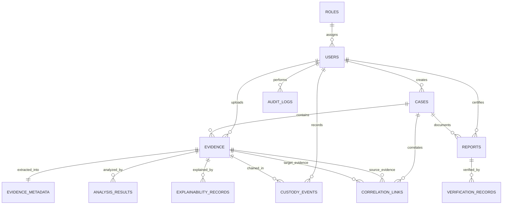

# NYAYAI – Database Architecture & Relational Schema Specification
**Phase 2: Database Architecture**  
**Lead Engineer**: Dhananjay Sharma (Backend & System Integration Lead)  
**Standard**: Relational Database Management System (PostgreSQL 15+ in production, SQLite 3 for localized testing)  
**ORM**: SQLAlchemy 2.0 (Declarative Mapping with Dialect-Adaptive JSON/JSONB)  
**Migrations**: Alembic (`alembic/`)  

---

## 1. Architectural Principles & Forensic Guarantees

1. **Strict File-Reference Storage (Zero Raw Binaries in DB)**:
   - Digital evidence media files (video, audio, high-resolution imagery, raw bitstream images) are **never** stored inside PostgreSQL.
   - Database stores deterministic cryptographic hashes (SHA-256), exact byte length, MIME types, and immutable storage references (`storage_reference` / `vault_path`) pointing to the Write-Once-Read-Many (WORM) storage vault.

2. **Tamper-Evident Hash-Chained Custody**:
   - The `custody_events` ledger implements an immutable, append-only cryptographic log.
   - Every custody event links to the preceding event via `previous_hash` and generates an `event_hash` covering sequence, actor, evidence ID, timestamp, and metadata payload.

3. **Flexible Forensic Data Structures (JSON/JSONB)**:
   - PostgreSQL `JSONB` with SQLite `JSON` fallback is employed for forensic attributes (`findings`, `exif_data`, `timestamps_metadata`, `anomalies`, and audit/verification `metadata`), enabling dynamic forensic analysis output indexing.

4. **Rigorous Relational Integrity**:
   - Primary Keys: Universal UUIDs/prefixed forensic codes (`EVD-XXXX`, `CASE-XXXX`).
   - Foreign Keys with explicit `ON DELETE` constraints (e.g. `RESTRICT` on Evidence to prevent deletion of evidentiary material).
   - High-throughput B-tree indexes on lookup columns (`case_number`, `sha256_hash`, `verification_code`, `status`, `created_at`).

---

## 2. Entity-Relationship Diagram



---

## 3. Core Relational Entities Specification

### 3.1 `roles` Table
Role-Based Access Control (RBAC) defining user authorization tiers across the platform.

| Column | Type | Constraints | Indexes | Description |
| :--- | :--- | :--- | :--- | :--- |
| `id` | VARCHAR(36) | PRIMARY KEY | PK | Unique UUID identifier |
| `name` | VARCHAR(64) | UNIQUE, NOT NULL | UNIQUE | Role title (`SYSTEM_LEAD`, `INVESTIGATOR`, `FORENSIC_EXPERT`, `AUDITOR`) |
| `description` | TEXT | NULLABLE | - | Scope of administrative authority |
| `permissions` | JSON / JSONB | NOT NULL, DEFAULT `'[]'` | - | Granular permission scopes (`["case:read", "evidence:intake"]`) |
| `created_at` | TIMESTAMP WITH TIME ZONE | NOT NULL, DEFAULT NOW() | - | Role creation timestamp |

---

### 3.2 `users` Table
Authenticated law enforcement officers, forensic specialists, and judicial auditors.

| Column | Type | Constraints | Indexes | Description |
| :--- | :--- | :--- | :--- | :--- |
| `id` | VARCHAR(36) | PRIMARY KEY | PK | Unique user identifier (UUID) |
| `username` | VARCHAR(64) | UNIQUE, NOT NULL | UNIQUE | Unique system login handle |
| `email` | VARCHAR(128) | UNIQUE, NOT NULL | UNIQUE | Official law enforcement email address |
| `hashed_password` | VARCHAR(256) | NOT NULL | - | Salted cryptographic password digest |
| `full_name` | VARCHAR(128) | NOT NULL | - | Officer / specialist real name |
| `badge_number` | VARCHAR(64) | NULLABLE | - | Official departmental identification badge number |
| `role_id` | VARCHAR(36) | FOREIGN KEY -> `roles.id`, NULLABLE | FK | Foreign key to assigned RBAC role |
| `role` | VARCHAR(32) | NOT NULL, DEFAULT `'INVESTIGATOR'` | - | Legacy role string fallback |
| `is_active` | BOOLEAN | NOT NULL, DEFAULT TRUE | - | Account activity flag |
| `created_at` | TIMESTAMP WITH TIME ZONE | NOT NULL, DEFAULT NOW() | - | Registration timestamp |

---

### 3.3 `cases` Table
Central investigative docket organizing evidence, reports, and timeline correlations.

| Column | Type | Constraints | Indexes | Description |
| :--- | :--- | :--- | :--- | :--- |
| `case_id` | VARCHAR(64) | PRIMARY KEY | PK | Unique case docket ID (`CASE-2026-0001`) |
| `case_number` | VARCHAR(64) | UNIQUE, NOT NULL | UNIQUE | Official Police Station / Court docket number |
| `title` | VARCHAR(256) | NOT NULL | - | Descriptive case heading |
| `description` | TEXT | NULLABLE | - | Comprehensive investigative summary |
| `status` | VARCHAR(32) | NOT NULL, DEFAULT `'OPEN'` | INDEX | Case status (`OPEN`, `UNDER_ANALYSIS`, `ADMISSIBILITY_READY`, `CLOSED`) |
| `jurisdiction` | VARCHAR(128) | NOT NULL, DEFAULT `'New Delhi'` | - | Designated court or police jurisdiction |
| `created_by` | VARCHAR(36) | FOREIGN KEY -> `users.id`, NOT NULL | FK | Lead investigating officer |
| `created_at` | TIMESTAMP WITH TIME ZONE | NOT NULL, DEFAULT NOW() | INDEX | Date and time docket was registered |
| `updated_at` | TIMESTAMP WITH TIME ZONE | NOT NULL, DEFAULT NOW() | - | Last modification timestamp |

*Backward Compatibility Synonym*: `investigator_id` maps directly to `created_by`.

---

### 3.4 `evidence` Table
Digital evidence repository entries. **Never stores raw binary files directly in the database.**

| Column | Type | Constraints | Indexes | Description |
| :--- | :--- | :--- | :--- | :--- |
| `evidence_id` | VARCHAR(64) | PRIMARY KEY | PK | Unique evidence serial number (`EVD-XXXX`) |
| `case_id` | VARCHAR(64) | FOREIGN KEY -> `cases.case_id`, NOT NULL | FK, INDEX | Parent investigative case docket |
| `original_filename`| VARCHAR(256) | NOT NULL | - | Filename at the time of intake/seizure |
| `stored_filename` | VARCHAR(256) | NOT NULL | - | Sanitized unique storage filename in vault |
| `media_type` | VARCHAR(128) | NOT NULL | - | Verified MIME type (`video/mp4`, `image/jpeg`, `audio/wav`) |
| `file_size` | BIGINT | NOT NULL | - | Exact byte length of the file |
| `sha256_hash` | CHAR(64) | NOT NULL | INDEX | SHA-256 cryptographic digest at intake |
| `storage_reference`| VARCHAR(512) | NOT NULL | - | Path / object URI in secure WORM vault storage |
| `status` | VARCHAR(32) | NOT NULL, DEFAULT `'SECURED'` | INDEX | Status (`SECURED`, `ANALYZING`, `ANALYZED`, `FLAGGED`, `ARCHIVED`) |
| `source_description`| TEXT | NULLABLE | - | Physical seizure location / device metadata |
| `uploaded_by` | VARCHAR(36) | FOREIGN KEY -> `users.id`, NOT NULL | FK | Intake officer identifier |
| `created_at` | TIMESTAMP WITH TIME ZONE | NOT NULL, DEFAULT NOW() | INDEX | Exact UTC timestamp of evidence intake |

*Backward Compatibility Synonyms*:
- `mime_type` $\rightarrow$ `media_type`
- `file_size_bytes` $\rightarrow$ `file_size`
- `vault_path` $\rightarrow$ `storage_reference`
- `intake_by_user_id` $\rightarrow$ `uploaded_by`
- `EvidenceItem` alias $\rightarrow$ `Evidence`

---

### 3.5 `evidence_metadata` Table
Extracted file-system, format-specification, and structural forensic metadata.

| Column | Type | Constraints | Indexes | Description |
| :--- | :--- | :--- | :--- | :--- |
| `metadata_id` | VARCHAR(64) | PRIMARY KEY | PK | Unique forensic artifact ID (`META-XXXX`) |
| `evidence_id` | VARCHAR(64) | FOREIGN KEY -> `evidence.evidence_id`, NOT NULL | FK, UNIQUE | Target digital evidence item (1:1 relationship) |
| `format_valid` | BOOLEAN | NOT NULL, DEFAULT TRUE | - | Verification against format standards |
| `magic_bytes` | VARCHAR(64) | NOT NULL | - | Initial hexadecimal file header magic bytes |
| `exif_data` | JSON / JSONB | NULLABLE | - | Camera, lens, GPS, and device EXIF properties |
| `timestamps_metadata`| JSON / JSONB | NULLABLE | - | Discrepancies between filesystem and internal timestamps |
| `anomalies` | JSON / JSONB | NULLABLE | - | Structural defects, trailing payloads, splice marks |
| `created_at` | TIMESTAMP WITH TIME ZONE | NOT NULL, DEFAULT NOW() | - | Forensic inspection completion timestamp |

*Backward Compatibility Synonyms*:
- `artifact_id` $\rightarrow$ `metadata_id`
- `exif_metadata_json` $\rightarrow$ `exif_data`
- `detected_timestamps` $\rightarrow$ `timestamps_metadata`
- `hex_anomalies_json` $\rightarrow$ `anomalies`
- `ForensicArtifact` alias $\rightarrow$ `EvidenceMetadata`

---

### 3.6 `analysis_results` Table
AI screening and forensic model predictions with flexible JSON/JSONB findings.

| Column | Type | Constraints | Indexes | Description |
| :--- | :--- | :--- | :--- | :--- |
| `analysis_id` | VARCHAR(64) | PRIMARY KEY | PK | Unique analysis record ID (`ANL-XXXX`) |
| `evidence_id` | VARCHAR(64) | FOREIGN KEY -> `evidence.evidence_id`, NOT NULL | FK, INDEX | Target evidence item analyzed |
| `analysis_type` | VARCHAR(64) | NOT NULL | INDEX | Classification (`DEEPFAKE_DETECTION`, `METADATA_VERIFICATION`, `AUDIO_SPLICING`, etc.) |
| `status` | VARCHAR(32) | NOT NULL, DEFAULT `'COMPLETED'` | - | Analysis status (`PENDING`, `PROCESSING`, `COMPLETED`, `FAILED`) |
| `prediction` | VARCHAR(64) | NOT NULL | - | Categorical prediction (`AUTHENTIC`, `TAMPER_DETECTED`, `SUSPICIOUS`, `INCONCLUSIVE`) |
| `confidence` | FLOAT | NOT NULL | - | Confidence metric $[0.0, 1.0]$ |
| `risk_score` | FLOAT | NOT NULL, DEFAULT 0.0 | - | Forensic risk index $[0.0, 1.0]$ |
| `findings` | JSON / JSONB | NOT NULL, DEFAULT `'[]'` | - | Detailed detection anomalies, frame timestamps, and heatmaps |
| `model_name` | VARCHAR(128) | NOT NULL, DEFAULT `'TamperResNet-v2'` | - | Name of executing neural / statistical model |
| `model_version` | VARCHAR(32) | NOT NULL, DEFAULT `'1.0.0'` | - | Model checkpoint version |
| `created_at` | TIMESTAMP WITH TIME ZONE | NOT NULL, DEFAULT NOW() | INDEX | Inference completion timestamp |

*Backward Compatibility Synonyms*:
- `result_id` $\rightarrow$ `analysis_id`
- `confidence_score` $\rightarrow$ `confidence`
- `findings_json` $\rightarrow$ `findings`
- `tamper_detected` (boolean helper property derived from `prediction`)
- `AIAnalysisResult` alias $\rightarrow$ `AnalysisResult`

---

### 3.7 `custody_events` Table (Hash-Chained Audit Ledger)
Cryptographic chain-of-custody ledger guaranteeing unbroken evidence provenance.

| Column | Type | Constraints | Indexes | Description |
| :--- | :--- | :--- | :--- | :--- |
| `event_id` | VARCHAR(64) | PRIMARY KEY | PK | Unique custody event ID (`EVT-XXXX`) |
| `evidence_id` | VARCHAR(64) | FOREIGN KEY -> `evidence.evidence_id`, NOT NULL | FK, INDEX | Target evidence item |
| `sequence_number`| INTEGER | NOT NULL | - | Monotonically incrementing per-evidence sequence ($1, 2, 3\dots$) |
| `event_type` | VARCHAR(64) | NOT NULL | INDEX | Action performed (`EVIDENCE_INTAKE_RECORDED`, `VAULT_SECURED`, `AI_ANALYSIS_EXECUTED`, `LEGAL_EXPORT`) |
| `user_id` | VARCHAR(64) | NOT NULL | INDEX | Actor ID / Officer badge who triggered event |
| `timestamp` | TIMESTAMP WITH TIME ZONE | NOT NULL, DEFAULT NOW() | INDEX | Immutable UTC timestamp |
| `description` | TEXT | NULLABLE | - | Human-readable log narrative |
| `previous_hash` | CHAR(64) | NOT NULL | - | SHA-256 of immediate prior block (or 64 zeros for Genesis) |
| `event_hash` | CHAR(64) | UNIQUE, NOT NULL | UNIQUE | Deterministic digest: $\text{SHA256}(\text{prev\_hash} + \text{seq} + \text{type} + \text{user} + \text{ts} + \text{payload})$ |
| `payload_json` | TEXT / JSON | NOT NULL, DEFAULT `'{}'` | - | Serialized forensic context at moment of event |

*Constraints*:
- `UNIQUE(evidence_id, sequence_number)`: Strictly prevents sequence collisions or event replacement.

*Backward Compatibility Synonyms*:
- `action` $\rightarrow$ `event_type`
- `actor_id` $\rightarrow$ `user_id`
- `previous_event_hash` $\rightarrow$ `previous_hash`

---

### 3.8 `audit_logs` Table
System-wide immutable security, access, and compliance journal.

| Column | Type | Constraints | Indexes | Description |
| :--- | :--- | :--- | :--- | :--- |
| `audit_id` | VARCHAR(64) | PRIMARY KEY | PK | Unique audit entry identifier (`AUD-XXXX`) |
| `user_id` | VARCHAR(36) | FOREIGN KEY -> `users.id`, NULLABLE | FK, INDEX | User account initiating action (NULL for system events) |
| `action` | VARCHAR(64) | NOT NULL | INDEX | Action code (`EVIDENCE_VIEWED`, `USER_LOGIN`, `EXPORT_REPORT`) |
| `resource_type` | VARCHAR(64) | NOT NULL | INDEX | Entity type touched (`CASE`, `EVIDENCE`, `REPORT`, `AUTH`) |
| `resource_id` | VARCHAR(64) | NULLABLE | INDEX | Primary key of the affected resource |
| `timestamp` | TIMESTAMP WITH TIME ZONE | NOT NULL, DEFAULT NOW() | INDEX | Exact UTC action execution timestamp |
| `metadata` | JSON / JSONB | NOT NULL, DEFAULT `'{}'` | - | Contextual payload (IP address, user agent, changes) |

*Technical Note*: Mapped in Python to `meta_data` to prevent collisions with SQLAlchemy Declarative `Base.metadata`.

---

### 3.9 `reports` Table
Legal certificates of electronic evidence under Section 63 & 65B of the Bharatiya Sakshya Adhiniyam, 2023.

| Column | Type | Constraints | Indexes | Description |
| :--- | :--- | :--- | :--- | :--- |
| `report_id` | VARCHAR(64) | PRIMARY KEY | PK | Unique report reference ID (`REP-XXXX`) |
| `case_id` | VARCHAR(64) | FOREIGN KEY -> `cases.case_id`, NOT NULL | FK, INDEX | Associated investigative case docket |
| `report_type` | VARCHAR(64) | NOT NULL, DEFAULT `'BSA_2023_SEC_63_65B'` | - | Legal reporting standard / certificate format |
| `status` | VARCHAR(32) | NOT NULL, DEFAULT `'GENERATED'` | INDEX | Status (`PENDING`, `GENERATED`, `SIGNED`, `REVOKED`) |
| `storage_reference`| VARCHAR(512) | NOT NULL | - | Storage path or URI to the generated PDF |
| `report_sha256` | CHAR(64) | UNIQUE, NOT NULL | UNIQUE | SHA-256 cryptographic digest of the compiled PDF report |
| `verification_code`| VARCHAR(64) | UNIQUE, NOT NULL | UNIQUE | Short high-entropy alphanumeric verification token |
| `qr_code_data` | TEXT | NULLABLE | - | URL / cryptographic payload encoded in QR stamp |
| `created_by` | VARCHAR(36) | FOREIGN KEY -> `users.id`, NOT NULL | FK | Certifying forensic officer or investigator |
| `created_at` | TIMESTAMP WITH TIME ZONE | NOT NULL, DEFAULT NOW() | INDEX | Timestamp certificate was compiled and sealed |

*Backward Compatibility Synonyms*:
- `pdf_path` $\rightarrow$ `storage_reference`
- `certifying_officer_id` $\rightarrow$ `created_by`
- `compliance_framework` $\rightarrow$ `report_type`
- `CourtReport` alias $\rightarrow$ `Report`

---

### 3.10 `verification_records` Table
Public or judicial verification access log for verifying court certificates via QR / online portal.

| Column | Type | Constraints | Indexes | Description |
| :--- | :--- | :--- | :--- | :--- |
| `verification_id` | VARCHAR(64) | PRIMARY KEY | PK | Unique verification event ID (`VER-XXXX`) |
| `report_id` | VARCHAR(64) | FOREIGN KEY -> `reports.report_id`, NOT NULL | FK, INDEX | Target report verified |
| `verification_method`| VARCHAR(32) | NOT NULL, DEFAULT `'PORTAL'` | - | Verification entry point (`QR_SCAN`, `PORTAL`, `API`) |
| `verifier_identifier`| VARCHAR(128) | NULLABLE | - | Optional name, court bench, or agency identifier |
| `status` | VARCHAR(32) | NOT NULL, DEFAULT `'VALID'` | - | Outcome (`VALID`, `EXPIRED`, `REVOKED`, `INVALID_HASH`) |
| `ip_address` | VARCHAR(45) | NULLABLE | - | IPv4/IPv6 client IP address |
| `timestamp` | TIMESTAMP WITH TIME ZONE | NOT NULL, DEFAULT NOW() | INDEX | UTC timestamp verification request occurred |
| `metadata` | JSON / JSONB | NOT NULL, DEFAULT `'{}'` | - | Request client headers, geo-IP, user agent |

---

## 4. Supplementary Forensic Modules

### 4.1 `explainability_records` Table
Human-interpretable forensic rationales and feature attribution maps (Anu Sharma & Ridhi Mashi).

| Column | Type | Constraints | Description |
| :--- | :--- | :--- | :--- |
| `record_id` | VARCHAR(64) | PRIMARY KEY | Unique record ID (`EXP-XXXX`) |
| `evidence_id` | VARCHAR(64) | FOREIGN KEY -> `evidence.evidence_id`, NOT NULL | Associated evidence |
| `reasoning_summary`| TEXT | NOT NULL | Plain-language judicial explanation of findings |
| `confidence_category`| VARCHAR(32) | NOT NULL | `HIGH`, `MEDIUM`, `LOW`, `INCONCLUSIVE` |
| `feature_attributions`| JSON / JSONB | NULLABLE | Key contributing visual, frequency, or metadata vectors |
| `limitations_disclaimer`| TEXT | NOT NULL | Known scientific caveats and failure modes |
| `created_at` | TIMESTAMP WITH TIME ZONE | NOT NULL, DEFAULT NOW() | Generation timestamp |

---

### 4.2 `correlation_links` Table
Cross-evidence correlation relationships and multi-source investigative ties.

| Column | Type | Constraints | Description |
| :--- | :--- | :--- | :--- |
| `correlation_id` | VARCHAR(64) | PRIMARY KEY | Unique link ID (`CORR-XXXX`) |
| `case_id` | VARCHAR(64) | FOREIGN KEY -> `cases.case_id`, NOT NULL | Enclosing case |
| `source_evidence_id`| VARCHAR(64) | FOREIGN KEY -> `evidence.evidence_id`, NOT NULL | Starting evidence artifact |
| `target_evidence_id`| VARCHAR(64) | FOREIGN KEY -> `evidence.evidence_id`, NOT NULL | Correlated evidence artifact |
| `relationship_type`| VARCHAR(64) | NOT NULL | `TEMPORAL_OVERLAP`, `SAME_LOCATION`, `COMMON_ENTITY` |
| `confidence` | FLOAT | NOT NULL | Correlation confidence metric $[0.0, 1.0]$ |
| `evidence_notes` | TEXT | NULLABLE | Contextual rationale for link |
| `created_at` | TIMESTAMP WITH TIME ZONE | NOT NULL, DEFAULT NOW() | Creation timestamp |

---

## 5. JSON / JSONB Structural Specifications

### 5.1 Analysis Findings Schema (`analysis_results.findings`)
```json
[
  {
    "frame_index": 104,
    "timestamp_sec": 4.16,
    "anomaly_type": "FACIAL_WARPING",
    "confidence": 0.94,
    "bounding_box": [120, 80, 240, 220],
    "description": "Boundary pixel inconsistencies indicative of face-swap synthesis"
  }
]
```

### 5.2 Evidence Metadata Schemas (`evidence_metadata`)
- **`exif_data`**:
  ```json
  {
    "Make": "Sony",
    "Model": "ILCE-7RM4",
    "Software": "Firmware 1.20",
    "ExposureTime": "1/250",
    "FNumber": 2.8,
    "ISO": 400
  }
  ```
- **`timestamps_metadata`**:
  ```json
  {
    "filesystem_created": "2026-09-24T18:00:00Z",
    "embedded_exif_created": "2026-09-24T18:00:00Z",
    "discrepancy_seconds": 0
  }
  ```
- **`anomalies`**:
  ```json
  [
    {
      "type": "CONTAINER_APPEND_DETECTED",
      "severity": "CRITICAL",
      "offset_bytes": 1048576,
      "details": "Trailing payload detected past MP4 moov atom"
    }
  ]
  ```

---

## 6. Migration and Seeding Commands

- **Initialize Tables and Seed Core Roles**:
  ```bash
  python database/init_db.py
  ```

- **Run Alembic Migrations**:
  ```bash
  alembic upgrade head
  ```

- **Execute Architecture Test Suite**:
  ```bash
  python -m pytest tests/test_database_architecture.py -v
  ```
